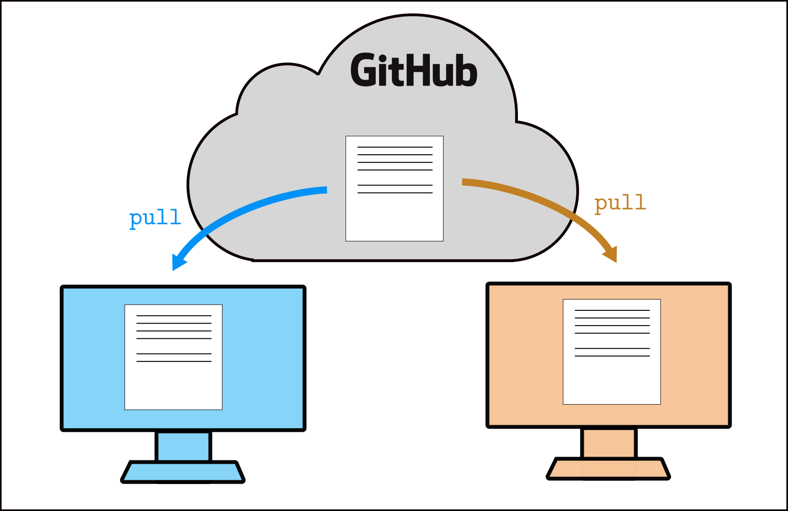
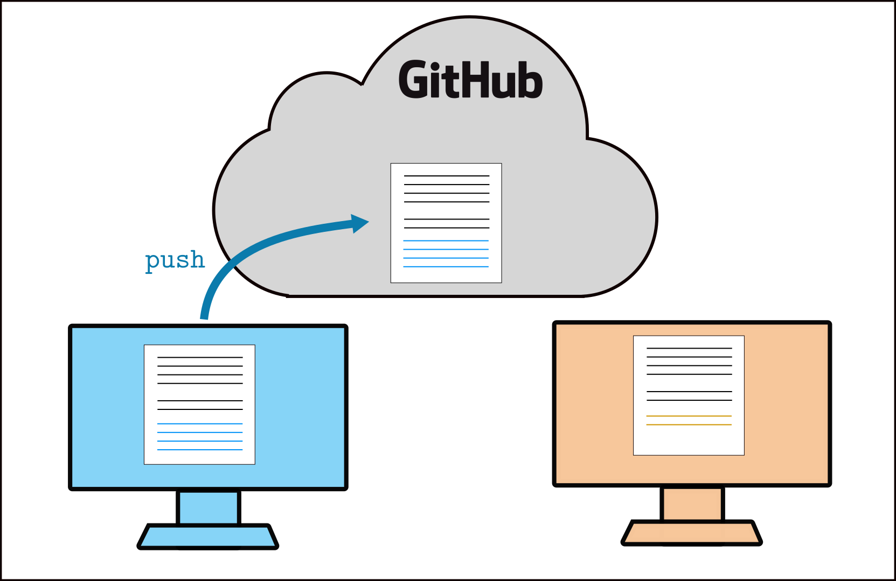
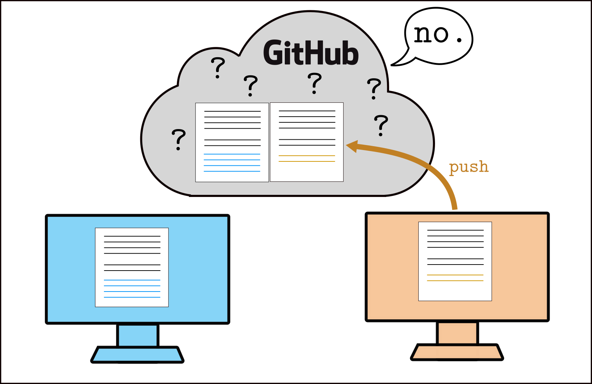
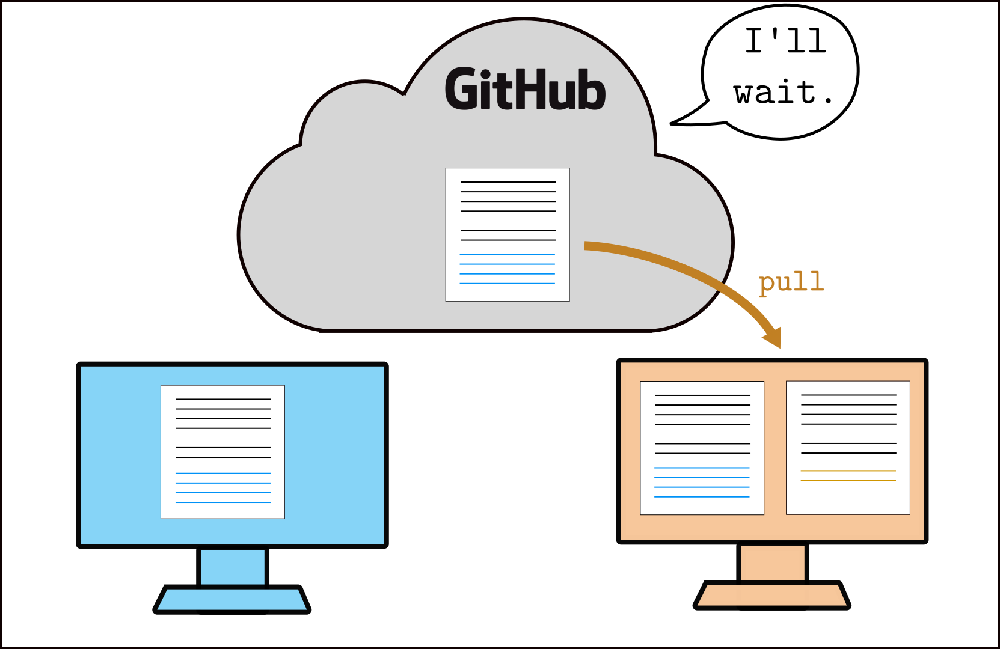
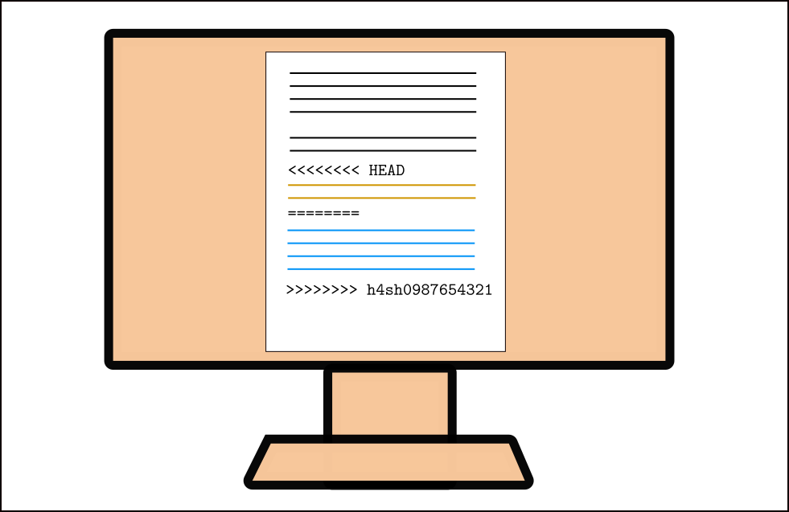
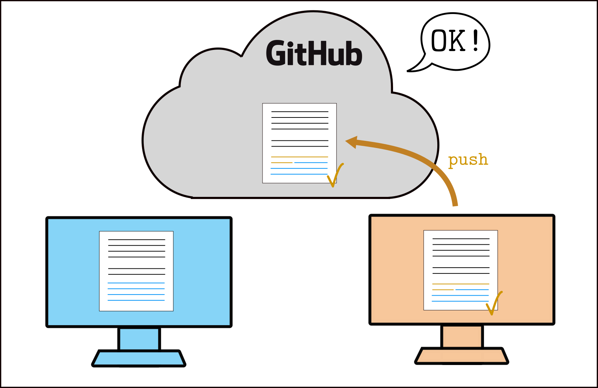
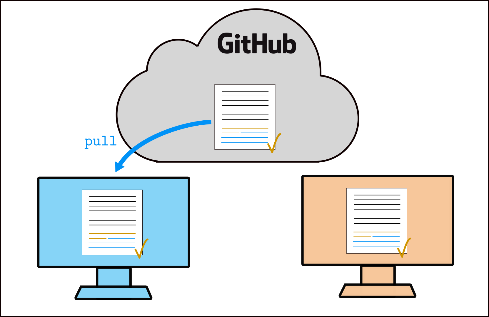

# Week 2 workshop - Fun with polynomials

This week, like in Week 1, you will pair-program with another student. You will use Python to evaluate polynomial derivatives. You will also learn what is a **merge conflict** and how to resolve it.

#### Roles

**Driver:** start sharing your screen if you haven't already, open VSCode (or other workflow of your choice -- this will be implied in all future mentions of "VSCode"), and clone your team repo to your computer. **Navigator**: watch closely and read these instructions to the driver.

Today, try to **switch roles** every 15 minutes, or every time you finish a part of the task (whichever comes **first**: if you are still working on Task 1 after 15 minutes for example, switch roles anyway, and the navigator will pick up where the driver left off). Every time you switch roles, unless indicated otherwise, this is what you should do:
- the **driver** **saves** the files that have been edited (Ctrl+S or Cmd+S), **stages** their changes, **commits**, and **pushes** to the GitHub repo.
- after this, the **navigator** becomes the driver, starts **sharing their screen**, **pulls** the changes from GitHub (or **clones** the repo if they haven't already done so) using VSCode, and continues working on the task until the next switch.

If you don't quite remember how to do all this, the navigator can go back to the [Week 1 workshop instructions](https://github.com/cnu-2021/cnu-w01-workshop) and walk the driver through the process.

**Note:** now that you have a little bit of experience with git and GitHub, we definitely recommend that you consult your editor's documentation on the subject, in case you're not sure how to do something using that editor. For VSCode: [Using version control in VSCode](https://code.visualstudio.com/docs/editor/versioncontrol)

## Task 1: Polynomial derivative

Consider a cubic polynomial of the form . The goal of this task is to write code to evaluate the **derivative** of p(x) at a point .

#### Driver:

You will see a script called `poly_derivative.py` in your repo, which contains variable definitions for `a0`, `a1`, `a2`, and `a3`, representing the polynomial coefficients of p(x), as well as `x0`, representing the point at which we want to evaluate the derivative of p(x).

Add your own code below these definitions to evaluate . If you're not sure where to start, take a pen and paper (or a tablet and whiteboard) and work out how you would approach the problem on paper; then, translate it to Python code.

There is already a test in the script for you to check your answer. Run the code to check if the test gives the correct results. Then, you can change the values of `x0` or the coefficients, change your test appropriately, and run the script again to check that it still works.

> When you are happy with your code, or after around 15 minutes (whichever comes first!), **switch roles**.

##### Code comments

In Python, anything on a line after the `#` character is called a **code comment**, and is ignored by Python. We use code comments to add annotations and useful explanations when writing code. Any code you write should always be well-commented!

Another useful use of comments, when working on a draft piece of code, is to "comment out" some parts of your code which you temporarily don't want to execute. In VSCode (and in Jupyter), you can select multiple lines with your mouse, and press `Ctrl + /` to toggle comments.

## Task 2: Conflict resolution with git

In the Week 1 workshop, the task was written so that driver and navigator would take turns working on the shared code -- this was to avoid **merge conflicts**. A merge conflict happens when two (or more) people modify the same file, at the same time. Generally, you want to **avoid** merge conflicts -- but sometimes they happen, and it's useful to know how to resolve them. We're going to cause one on purpose.

- **Driver** and **navigator**, make sure you both have the latest version of your joint work on both your computers. If not, the **driver** should push their latest changes, and the **navigator** should pull these changes.
- **Driver** and **navigator**: if there isn't already one, **write a useful code comment** just above the part of your script where you calculate the derivative. Make sure you **each write a different comment**, on the **same line** (otherwise there won't be a conflict!). Both of you should **stage** and **commit** your changes -- **but don't push yet**. (If you already had a code comment there, then you should both change it to something different.)

- **Navigator**: push your changes on the GitHub repo. This should work without issues.
- **Driver**: check on the GitHub repo that the navigator's changes are there. Then, **try to push** your own changes -- this should fail.

This is what is happening: you both start with the same files.

Then, the driver (orange) and navigator (blue) both make some changes locally, which they stage and commit. Now, each person's version is different from the original (still on GitHub), in a different way. The navigator (blue) pushes their changes, they are incorporated to the original file normally.

Then, the driver (orange) tries to push their changes -- but the original file has changed *at the same place* since the driver last pulled it, so git doesn't know which changes should be kept. This is a conflict.

- **Driver**: you now need to resolve the merge conflict. **Pull** the changes from GitHub, which will now also incorporate the navigator's changes. git will tell you that you need to **resolve the merge conflict** manually.

- **Navigator**: watch closely!
- **Driver:** in VSCode (or another editor), open the file with the conflict (git should tell you which file it is -- in our case, it should be `poly_derivative.py`. You will see something like this:

- **Driver:** your local changes are between `<<<<<<<< HEAD` and `========`. The navigator's changes (coming from GitHub) are between `========` and `>>>>>>>> ...`. VSCode should display some buttons you can click to directly choose either one or the other; you can also edit the file manually if you want to have a mix of the 2 versions. The important thing is that you remove the **conflict markers** (`<<<<<<<< HEAD`, `========`, and `>>>>>>>> ...`) to indicate that there is no longer a conflict.

- **Driver:** once you're satisfied with the changes, **save** the file, then **stage** and **commit** the changes. Congratulations -- you have now resolved the merge conflict! You can now push the changes on GitHub.

- **Navigator**: **pull** the changes from GitHub. You will now see the new changes, where the conflict was resolved by the driver. git doesn't complain here, because it knows that the conflict has been resolved.

#### That was a little bit painful...

The best way to handle merge conflicts is to try to **avoid** them as much as possible. Whenever you start or pick up your work, whenever you start changing files locally, **always start by fetching/pulling** the latest changes from GitHub. While you are working, you can also keep pulling changes regularly, just in case your teammate is also working on the same code at the same time -- this will ensure that if there has to be a merge conflict, it will be smaller and easier to resolve.

And always before pulling, make sure all your own changes are **committed**.

## Task 3: Further work

If you still have some time today, but haven't had a chance to review the Week 2 material yet, it's a good time to start! Continue pair-programming with your partner and start working through the Week 2 tutorial sheet exercises. You can create a new `.py` file in this repository, for instance, and solve the exercises in that file (so that you both have access to your work after the workshop finishes). Don't forget to switch roles at least one more time before the end.

If you've already reviewed some or all of the Week 2 material, then you may know about lists, loops, and maybe even functions. Using these, you can modify your code to make it more reusable. **Don't forget to commit your changes** when you implement something new (not just when changing roles)!

Here are some suggestions, in order of increasing complexity:
- Put all the polynomial coefficients in a list `a`, so that `a[0]` represents the coefficient , etc.
- Use a loop over the list `a` to calculate the derivative instead of writing out the whole sum.
- Once you have the loop, add or remove some coefficients to the list `a` to represent polynomials of arbitrary degree, and check that your code still works by testing it. Now, a list of length `N` will represent a polynomial of degree `N-1`, with the coefficient corresponding to the degree `0` term in first position, and the coefficient corresponding to the degree `N-1` term in last position. You can make some of the coefficients zero.
- Write a function `eval_derivative()` which takes 2 input arguments, a list of coefficients `a` and a number `x0`, and returns the value of the derivative of the polynomial defined by the coefficients `a` at `x0`. Make sure you include a docstring in your function.
- *If you want a challenge:* modify your function to take a third input argument, an integer `m`, and return the `m`th order derivative of the polynomial evaluated at `x0`.

You should write some tests to make sure that your function returns the correct output for different polynomials and values of `x0`. (You can reuse your previous tests.)
